# 📚 cityBookStore

cityBookStore is a Flutter application where users can browse books, add them to their cart, and place orders. It fetches book data through HTTP calls from a REST API. The app also supports login and logout functionality.

---

## 🚀 Project Overview

With this app, users can:

- 📖 Browse a list of books
- ➕ Add favorite books to their Cart
- 🛒 Place orders from the Cart
- 🔐 Login and Logout to manage their account

cityBookStore is built using Flutter and fetches book data in real-time from the Potter API.

---

## ✨ Features

- 🔍 Browse and view detailed information about books
- ➕ Add books to Cart
- 🛒 Place orders for books
- 🔐 User Login and Logout functionality
- ⚡ Smooth and responsive user interface
- 📡 Real-time data fetching from API

---

## 🌐 API Information

- **Base URL:** `https://potterapi-fedeperin.vercel.app/`
- **Sample API Response:**

```json
{
  "number": 1,
  "title": "Harry Potter and the Sorcerer's Stone",
  "originalTitle": "Harry Potter and the Sorcerer's Stone",
  "releaseDate": "Jun 26, 1997",
  "description": "On his birthday, Harry Potter discovers that he is the son of two well-known wizards, from whom he has inherited magical powers. He must attend a famous school of magic and sorcery, where he establishes a friendship with two young men who will become his companions on his adventure. During his first year at Hogwarts, he discovers that a malevolent and powerful wizard named Voldemort is in search of a philosopher's stone that prolongs the life of its owner.",
  "pages": 223,
  "cover": "https://raw.githubusercontent.com/fedeperin/potterapi/main/public/images/covers/1.png",
  "index": 0
}

```

## 🛠️ Technologies Used
- Flutter - Frontend Development

- Dart - Programming Language

- HTTP Package - REST API Integration

- Getx Statemanagement

- Shared Preferences - For login persistence


## 📥 Setup Instructions
- Clone this repository:

```
https://github.com/OmegaSoftErp/-Flutter-Book-Store-App.git
```
- Install Flutter packages:
```
flutter pub get
```
- Run the project:
```
flutter run
```
## 📸 Screenshots
|             Splash Page              |           Onboarding Page 1            |           Onboarding Page 2            |
|:------------------------------------:|:--------------------------------------:|:--------------------------------------:|
| 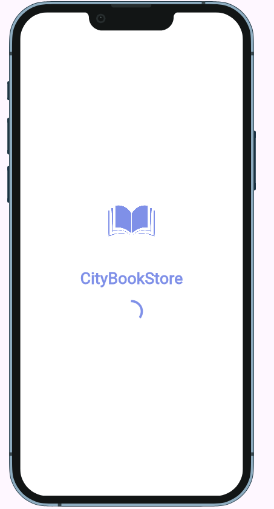 | 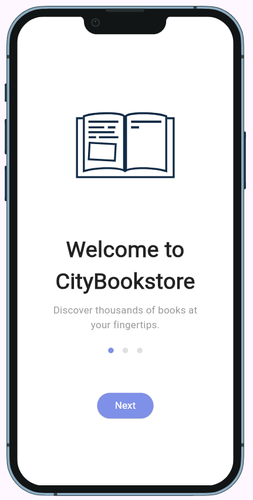 |  |

|            Sign in Page             |             SignUp Page              | Home Page  light mode              |
|:-----------------------------------:|:------------------------------------:|:-----------------------------------|
|  |  |  |

|       Home Page Dark Mode        |        Cart Page Light Mode        | Cart Page Dark Mode              |
|:--------------------------------:|:----------------------------------:|:---------------------------------|
|  | 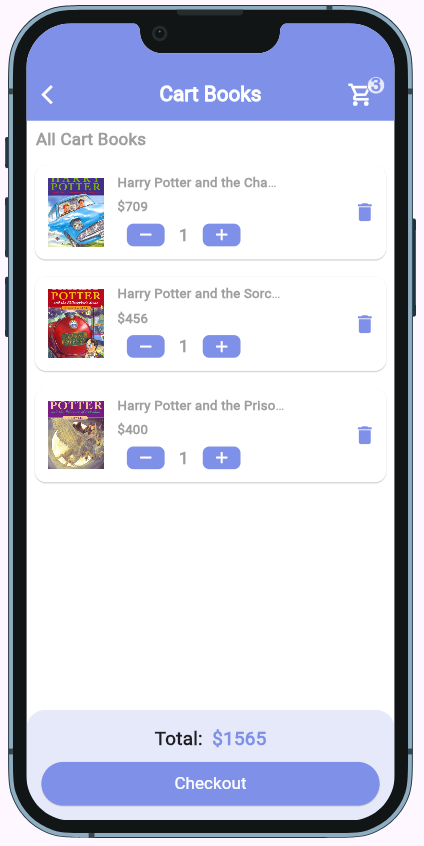 | 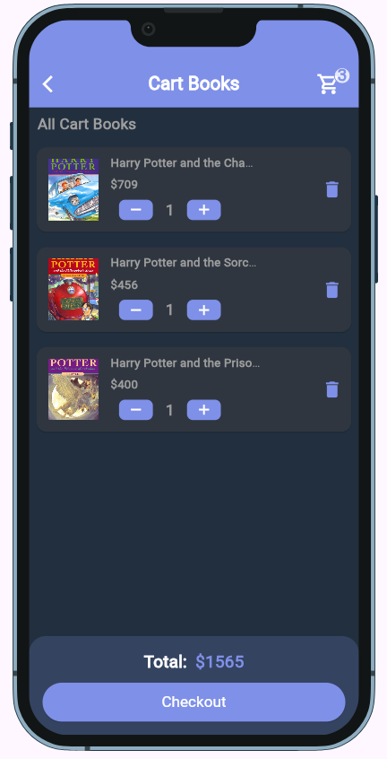 |

|          Wish List Light Mode          |         Wish List Light Mode         |        Details Page Light Mode        |
|:--------------------------------------:|:------------------------------------:|:-------------------------------------:|
| 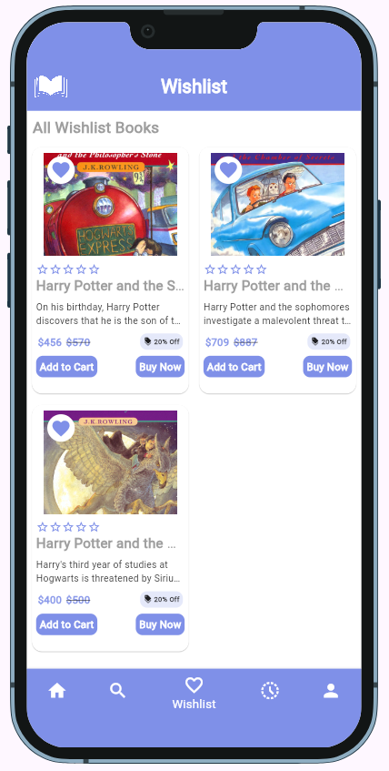 | 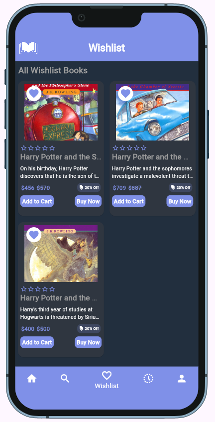 | 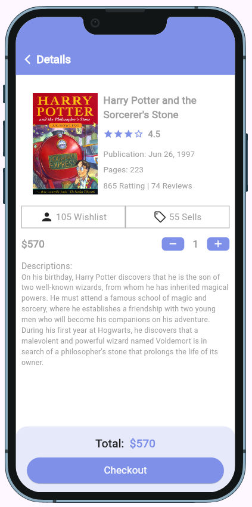 |

|       Details Page Light Mode       |        Search Page Light Mode        | Search Page Light Mode             |
|:-----------------------------------:|:------------------------------------:|:-----------------------------------|
| 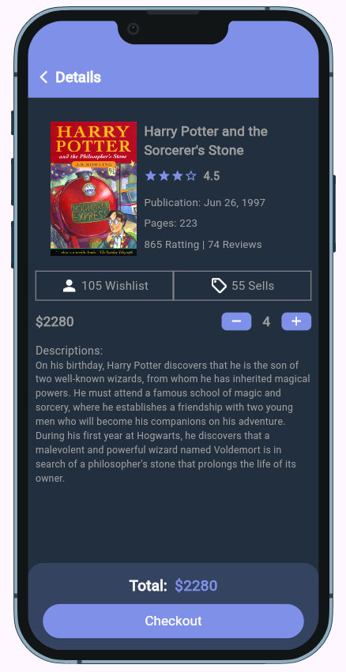 | 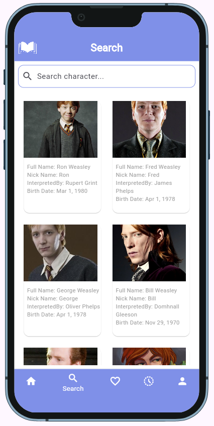 | 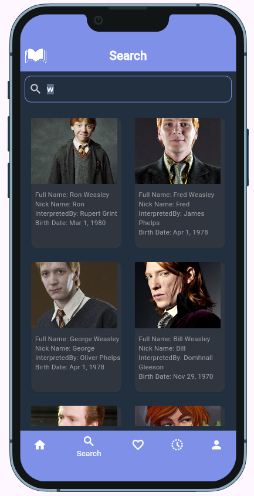 |

|      Order History Light Mode       |   Order History Page Dark Mode    | Profile View Light Mode             |
|:-----------------------------------:|:---------------------------------:|:------------------------------------|
| 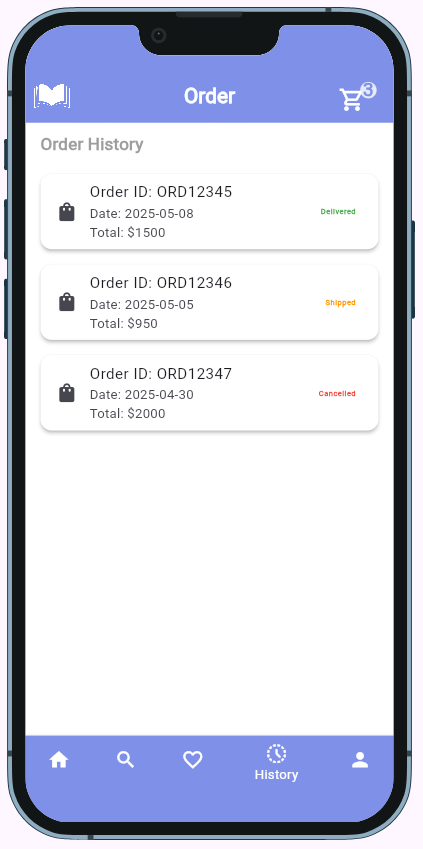 | 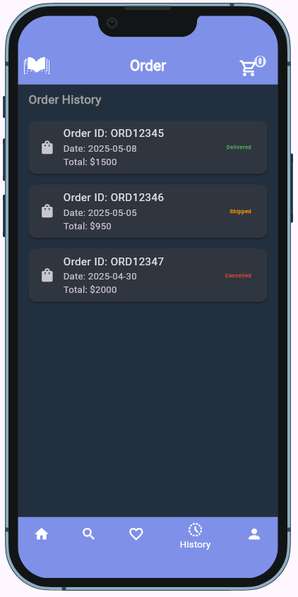 |  |


## 🙋‍♂️ Author
- Name: Robiul Suny

- LinkedIn: https://www.linkedin.com/in/robiulsunnyemon/

- GitHub: https://github.com/robiulsunnyemon